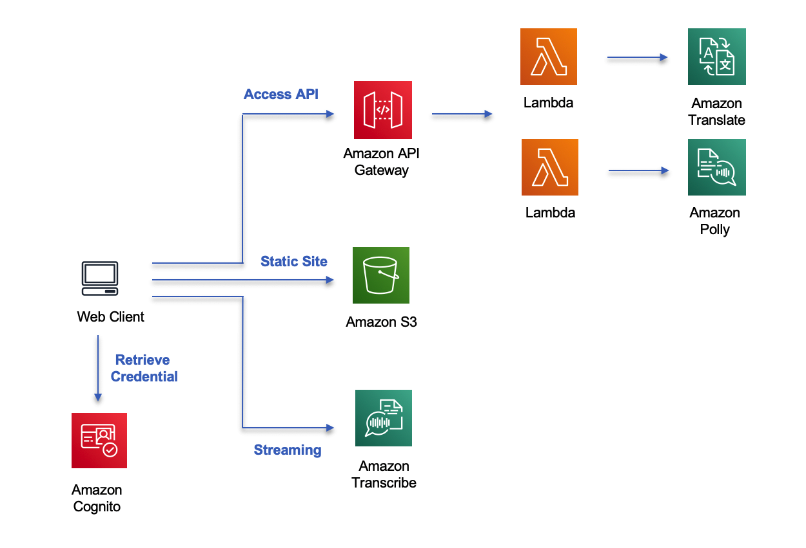

# Realtime Translator

This is a realtime translator built using AWS Serverless (API Gateway and Lambda) and AI Services (Transcibe, Translate and Polly). Checked this link for online demo:

https://translator.demo.cbuilder.tech/

## Architecture



The backend api is deployed using AWS SAM and the front-end is deployed to S3 as static web site and using Cloudfront for caching.

## Deploy

### API

Use AWS SAM to deploy the api gateway and lambda into AWS account.

```bash
cd api
sam build
sam deploy --guided
```

record the output for transaltor API which is needed to update the frontend.

### Front end

Update variable `api_url` in `lib/main.js` to the actual transaltor API deployed into your AWS account. And run following command for update:

```bash
npm run-script build
```

Use `deploy_to_s3.sh` to copy all the static files into S3 bucket and enable public read access. Use Cloudfront as cache and do enable https for accessing local microphone.

## References

- [Demo for Transcribe Streaming over a WebSocket](https://github.com/aws-samples/amazon-transcribe-websocket-static)